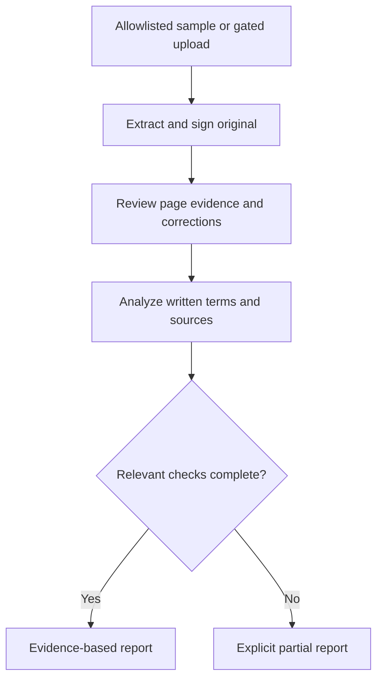

# WazehTerms

**Understand the terms before you sign.**

WazehTerms is an employment-document review assistant for people in Pakistan considering private-sector work in the United Arab Emirates. It helps a worker read a job offer and employment contract, compare what each document says, and identify terms that deserve a question before signing.

The project is in **active development**. This README describes the accepted target MVP, not a claim that its routes, integrations, tests, or public deployment already work. Implementation proceeds phase by phase under `plans/` from the contracts in `docs/`; inspect the actual repository, its phase logs, and its test results before assuming any capability exists.

## What the application does

A user can provide an offer, a contract, or both. WazehTerms is designed to:

1. Extract key employment terms with the page and exact passage supporting each value.
2. Let the user review and correct the extracted terms.
3. Compare an offer and contract field by field using application logic.
4. Retrieve relevant official material from a curated knowledge base when a rule-based concern needs support.
5. Present differences, unresolved wording, and source-backed concerns in plain language, with questions the user can ask the employer or recruitment intermediary.

A single document can yield a summary of terms and questions to ask. A comparison requires two sufficiently readable documents. WazehTerms provides information for review; it does not verify an employer, authenticate a document, certify legal compliance, or replace advice from a qualified professional or relevant authority.

## Current scope

| Area | Initial boundary |
| --- | --- |
| Employment route | Pakistan to the UAE |
| Worker category | UAE mainland private-sector, non-domestic employment, when the category can be established |
| Decision point | Reviewing terms before signing |
| Inputs | Readable PDF documents; image support requires its own extraction and quality checks |
| Language | English analysis; other languages require separate validation before they are presented as supported |
| Output | Document comparison, questions to ask, and carefully sourced rule concerns |
| Data retention | Transient analysis; no account or archive of personal documents in the initial product |
| Public starting mode | Five server-allowlisted fictional samples; arbitrary files are rejected until the custom-upload gate passes |

The initial system does not cover domestic workers, government employment, free-zone-specific regimes, other destination countries, employer reputation, identity or visa verification, filing complaints, or broad legal compliance assessment. A document outside the supported category can still show extracted terms and direct document differences where those are readable; it must not receive a rule conclusion that assumes the wrong regime.

The user supplies the intended employment category and destination. The application checks the documents for conflicting clues and treats uncertain or contradictory category information as unresolved. A logo, company name, or address alone is insufficient proof of the governing regime.

Readable English PDF and English reporting are the assured paths **after validation**. JPG/PNG and Urdu explanation each require separate testing before the UI advertises them. The deployed capabilities endpoint, not an earlier project plan, determines what the public can submit.

## Terms reviewed

The document model covers these groups. Each extracted value needs its original wording and location; a model-produced summary by itself is insufficient evidence.

| Group | Examples |
| --- | --- |
| Parties and role | Employer name, job title, work location |
| Pay | Basic salary, each allowance, stated total, currency, payment frequency |
| Benefits | Accommodation, meals, transport, medical coverage, travel or return ticket |
| Worker costs | Recruitment charges, visa or residency charges, medical and travel costs, deductions, and the named payer |
| Working terms | Start date, duration, probation, ordinary hours, overtime, notice, termination wording |
| Completeness | Dates, signatures, document identifiers, references to annexes or policies |

Basic salary, allowances, and total compensation are distinct fields. Conditional benefits are represented as conditional; a reference to a separate policy is not assumed to grant or remove a benefit. Pakistan-side processing fees and UAE-side employer charges are also distinct categories, with separate actors and sources.

## Documented v1 review flow



The UI reads `GET /api/v1/capabilities` and `GET /api/v1/samples`. If `customUploadEnabled` is false, the server rejects **every arbitrary user file** with `403 CUSTOM_UPLOAD_DISABLED`, even one described as fictional. A sample is selected only by an allowlisted `sampleCaseId`. In the target runtime, sample PDFs also go through Gemini extraction; hand-authored extractions belong in deterministic test fixtures, not an unlabelled runtime fallback.

`POST /api/v1/extractions` validates the PDF, processes bounded content inline through Gemini, and returns the original `IssuedExtractionV1` plus an HMAC proof and expiry. The browser holds that signed payload and the selected-file preview only in memory. The user checks the original page passages and records separate corrections. `POST /api/v1/analyses` receives the **unchanged original payload and proof** plus correction deltas. There is no application case database, server review session, or report-by-ID read; refreshing loses the review.

Application code validates, normalizes, and compares explicit terms. Basic salary, each allowance, stated total, currency, and frequency remain distinct. A language model may phrase an established finding, but cannot create a mismatch, change its category, or manufacture supporting evidence. A correction without documentary support remains labelled user supplied and cannot establish a confirmed mismatch alone.

Rule review is separate from document comparison. The server queries an application-facing **Knowledge Base-only Sanity Context MCP endpoint** for candidate material, then reads a matching approved, current canonical Sanity rule and exact source version/pinpoint. A concern is displayed only when the official passage, jurisdiction, worker category, responsible party, conditions, and dates are checked. If source retrieval is unavailable or applicability remains uncertain, substantiated document differences remain usable in an explicitly `partial` report, while the rule claim is withheld. `GET /health` is a minimal root-level probe; the public API is same-origin under `/api/v1` and returns `Cache-Control: no-store`.

### Finding categories

| Category | When it applies |
| --- | --- |
| **Document mismatch** | Two readable, explicit terms differ in a meaningful way. Show both passages and pages. |
| **Source-backed concern** | An applicable official source supports a specific concern about a document term. Show the source, pinpoint reference, scope, and date. |
| **Missing information** | A material term cannot be located in a document that has been read sufficiently to make that observation. |
| **Needs clarification** | Wording is conditional, incomplete, refers to an unseen annex, or admits multiple readings. |
| **Unable to determine** | The relevant text is unreadable, a required document is missing, or source applicability cannot be established. |

These categories can coexist. Absence in one document does not automatically prove a contradiction. Only after relevant checks complete without a flagged concern may the report say **“No concern detected in the fields checked.”** A partial report must identify omitted checks and cannot use that line as a whole-review reassurance.

## Evidence contract

The evidence model is a core product requirement. Implementation details may change, but these invariants should remain:

- Each extracted field has a state: `present`, `absent`, `unclear`, or `unreadable`. A present value includes the document ID, page number, and verbatim passage. Absence is recorded only after the relevant readable pages have been checked.
- Normalized values keep the original text. Monetary values carry amount, currency, frequency, and whether they are basic pay, an allowance, a total, or a charge. Costs also carry the stated payer.
- A user correction records both the original extraction and the corrected value. The report shows which value was used for comparison.
- Every mismatch identifies the fields compared, each document's evidence, and the comparison rule used. A missing term is never silently converted into an adverse term.
- Every rule concern carries an internal rule ID, issuing authority, official URL, exact clause or page, jurisdiction, applicable worker category and actor, effective period where known, and source-check date. Unverified or superseded material cannot support a current definitive claim.
- Retrieval text is treated as untrusted input. Instructions embedded in uploaded documents, web pages, or knowledge-base entries must not change the analysis policy or authorize tool use.
- If a citation opens to a page that does not support the claim, the claim is withheld. A source's general reputation is not a substitute for a matching passage.

The exact runtime schemas belong to `API.md`. A shortened view of one original field is:

```ts
type FieldState = "present" | "absent" | "unclear" | "unreadable";

type EvidenceVerification = "matched_text" | "model_transcription";

interface ExtractedField {
  fieldKey: string;
  instanceId: string;
  state: FieldState;
  rawText: string | null;
  value: NormalizedValue | null; // discriminated union in API.md
  evidence: Array<{
    documentId: string;
    page: number; // one-based
    quote: string;
    verification: EvidenceVerification;
  }>;
  qualityNotes: string[];
}
```

Corrections are separate request objects keyed by existing `documentId` + `fieldKey` + `instanceId`; they do **not** live inside or overwrite the signed original. The 12 field groups contain **33 distinct component keys**; repeated allowances and deductions have distinct `instanceId` values. Money uses a decimal **string**, not a JavaScript float, with currency, frequency, component, and stated payer where established. A `model_transcription` passage is not an independently matched PDF quote. HMAC is an integrity check, not encryption, user authentication, or protection against replay within its short lifetime.

## System design

The intended application uses:

- **Web:** React, TypeScript, Vite, Tailwind CSS, and shadcn/ui for uploads, extraction review, and an evidence-first report.
- **API:** Node.js, TypeScript, and Express for validation, orchestration, comparison, and report assembly.
- **Document extraction:** Gemini document understanding with structured output. Model output is schema validated before it enters comparison logic.
- **Knowledge:** Sanity Content Lake for curated source and rule records; a Sanity Knowledge Base exposed through Sanity Context MCP for agent retrieval.
- **Hosting:** Built React assets and the Express API in one Cloud Run service under one origin; Sanity Studio is a separate editor surface.

The knowledge layer stores public or otherwise authorized reference material and its metadata. It must not receive uploaded offers, contracts, personal identifiers, or raw analysis logs. The Context MCP is a read-only retrieval interface; the application owns the model calls, tool orchestration, applicability checks, and user-facing decisions.

The intended application Context MCP endpoint has **Knowledge Base sources only**. A filtered projection of approved dataset records may *feed the Knowledge Base*, but the dataset source must not be attached directly to the agent endpoint: that would switch it to GROQ mode. The coding editor's Sanity MCP connection is distinct from this runtime endpoint. Verify the runtime endpoint's tools and a live known-answer read before claiming source retrieval works. Knowledge Base entries can change after a rebuild; the curated rule record and exact official pinpoint still need independent verification.

### Reference content

The knowledge model separates:

- `authority`: issuer name, official domain, and jurisdiction.
- `sourceDocument`: official URL or authorized file, title, issuer, publication and effective dates, scope, status, and last checked date.
- `rule`: narrowly phrased claim, topic, responsible actor, jurisdiction, worker category, conditions, effective period, source ID, and pinpoint clause or page.
- `contractFieldDefinition`: canonical field name, common labels, expected type, comparison behavior, and relevant rule topics.
- `resolutionNote`: documented handling of conflicting or superseded sources.

Official Pakistan and UAE sources should be recorded separately. The links in `SOURCES.md` are **research candidates**, not automatically approved rules. Some BEOE material was inaccessible to automated fetches during planning and needs manual inspection of the real official page/PDF and supporting passage before approval. International material can provide clearly labelled supplementary guidance; it does not become binding national law because it appears in a Knowledge Base. Source changes require reviewing affected versioned rules and refreshing or rebuilding the KB, then checking the live retrieved entry.

## Privacy, security, and reliability

Employment documents often include sensitive personal information. The interface should ask users to redact identity numbers, signatures, addresses, and other unnecessary identifiers before upload. Public samples must use fictional people and employers and be visibly marked as synthetic. Real arbitrary uploads remain disabled until the provider account/API behavior, privacy notice, cleanup, logging, consent, and limits are reviewed and tested.

The API should enforce content-type and file-signature checks, measured size and page limits, bounded processing time, throttling, and controlled concurrency. Credentials stay server-side. Do not log raw text, identifiers, quotes, signed extractions, prompts, or secrets, and remove any local temporary files on success, failure, cancellation, and timeout. The MVP sends bounded PDFs **inline** to Gemini, without the provider Files API; inline processing still has provider-specific data-handling behavior and must not be advertised as zero retention. Adding provider-side uploads needs a new lifecycle, deletion handling, notice, tests, and architectural review.

If extraction, source retrieval, or explanation fails, the report must say which part could not be completed. A partial result must not be presented as a complete review. The service should never use an overall "safe", "fraudulent", or "legal" badge.

## Sample data and evaluation

The planned corpus has **15 labelled synthetic cases**: four consistent pairs, six mismatch pairs, three costs/deductions or missing-term cases, and two low-quality/incomplete/adversarial cases. Five are reproducible public demonstration samples. Public job listings may inform plausible attributes but are neither signed offers nor contracts. Real worker documents require a separate consent and data-handling process before evaluation.

Each case should carry a machine-readable expected result, including extracted values, seeded differences, expected finding categories, relevant source IDs, and expected abstentions. Representative cases include:

- Matching offer and contract terms.
- An explicit salary or benefit change, with both source passages.
- A stated worker-paid charge whose treatment depends on the payer and applicable jurisdiction.
- A missing or conditional benefit that requires a question rather than an invented comparison.
- An unreadable, unsupported, or out-of-scope document that triggers a limited result.
- A document containing instructions aimed at the model, which must be treated as document text.

Evaluation should separately record extraction correctness, mismatch detection, unsupported claims, citation support, latency, and appropriate abstention. Report achieved counts and denominators, rather than presenting the targets in `PRD.md` as results. A document-only partial demonstration is an implementation milestone; full MVP acceptance also requires live Sanity retrieval and approved-rule verification.

## Implementation and local development

Implementation lands phase by phase under `plans/`. Inspect the **actual** source tree, package scripts, phase plan, and Git state before running or changing it; no install command, CI job, environment template, or public URL is claimed here without verification. Add tested setup/build/test/deployment commands and observed integration status as phases complete. Follow the phase plan under the repository's plans directory, using its on-disk casing.

The target server-side configuration includes a Gemini credential, a Sanity **organization** token with Context Viewer access, a Knowledge Base-backed Context MCP URL, a separate canonical read credential when necessary, and an HMAC signing key. `DEPLOYMENT.md` gives proposed settings; actual variable names and limits must match the running code. Studio setup alone does not prove a working KB endpoint or runtime token. None of these secrets belongs in the client or source control. A missing Gemini connection cannot be masked by a prewritten sample extraction; a later source outage may still allow substantiated document-only results marked `partial`.

## Documentation map

| File | Governs |
| --- | --- |
| `PRD.md` | User, scope, product acceptance, and independent release gates. |
| `ADR.md` | Accepted decisions and how to supersede one. |
| `TECHNICAL_ARCHITECTURE.md` | Boundaries, signed two-step flow, and failures. |
| `DATABASE_SCHEMA.md` | Versioned Sanity reference records and active field keys. |
| `SOURCES.md` | Candidate official material, rule approval, and ongoing source review. |
| `API.md` | Exact v1 routes, payloads, proof, correction, report, and error shapes. |
| `FRONTEND_SPECIFICATION.md` | Screens, capability gates, evidence display, and accessibility. |
| `SECURITY.md` | Data handling, trust boundaries, and privacy gates. |
| `TESTING.md` | Corpus, test layers, metric denominators, and release evidence. |
| `DEPLOYMENT.md` | One-service topology, configuration, smoke checks, and rollback. |

## Source and platform references

The following are starting points for source curation and integration. Each individual rule still needs a dated, pinpointed source record and review before it is used in a report.

- [Bureau of Emigration and Overseas Employment: Emigration Rules](https://beoe.gov.pk/files/legal-framework/Emigration_Rules_1979_Updated_2023.pdf)
- [UAE Government: job offers and the employment process](https://u.ae/en/information-and-services/jobs/employment-in-the-private-sector/job-offers-and-work-permits-and-contracts/expatriates-employment-in-private-sector)
- [UAE Government: employment laws and regulations](https://u.ae/en/information-and-services/jobs/employment-in-the-private-sector/employment-laws-and-regulations-in-the-private-sector)
- [Sanity Context and Knowledge Bases](https://www.sanity.io/docs/ai/sanity-context)
- [Sanity Context retrieval modes](https://www.sanity.io/docs/ai/sanity-context-retrieval-modes)
- [Gemini document understanding](https://ai.google.dev/gemini-api/docs/document-processing)
- [Gemini structured output](https://ai.google.dev/gemini-api/docs/structured-output)

## License

A license has not been selected. Until one is added, the repository does not grant reuse rights beyond those otherwise provided by law.
