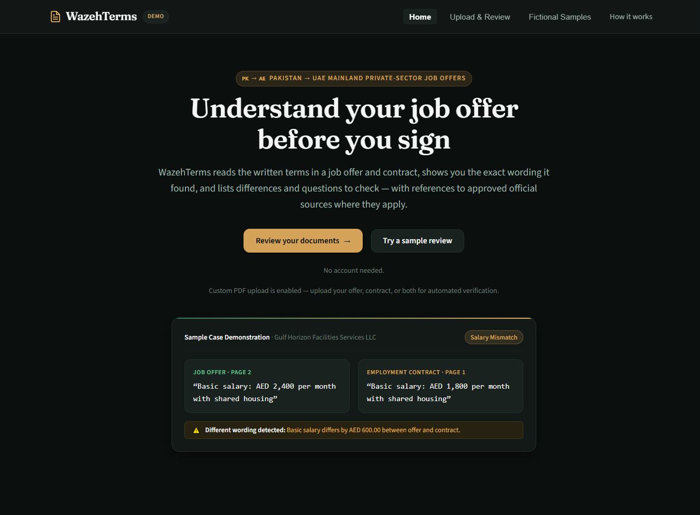
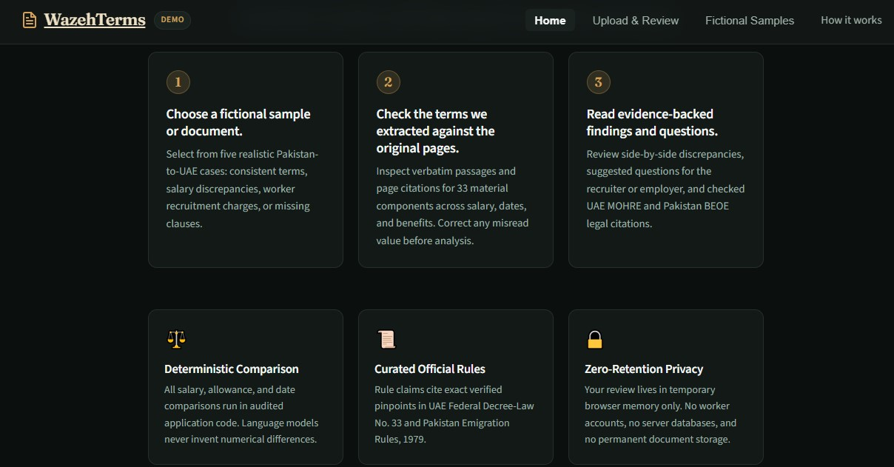
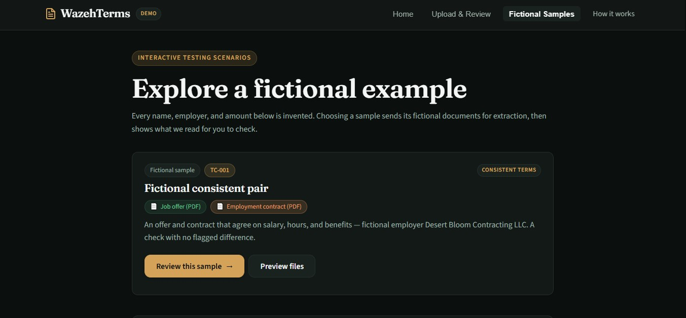
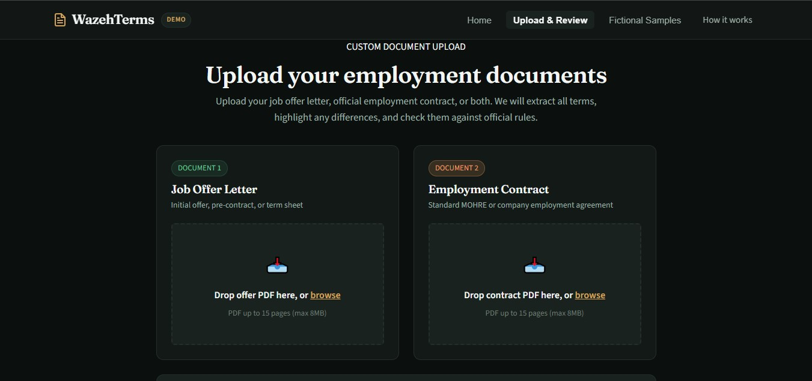

# Building WazehTerms: A Clearer Way to Read a Job Offer Before Signing

Many workers do not sign a job offer because every term is perfectly clear. They sign because the process is moving quickly, the documents look official, and the important details are buried in long pages of formal wording.

WazehTerms was built for one practical moment: a person in Pakistan is considering private-sector work in the UAE and wants to understand what the offer letter and employment contract actually say before signing.

The app does not try to replace a lawyer, government office, recruiter, or trusted adviser. Instead, it focuses on something smaller and very useful: reading the written terms, showing the exact wording, comparing the documents, and turning confusing points into clear questions.

## The Problem

Employment documents can be difficult to compare by hand. A job offer may say one salary, while the later contract says another. An allowance may be included in one document but missing in the other. A benefit may be conditional, hidden in an annex, or described with wording that needs clarification.

For a worker, these details matter. A small difference in basic salary, accommodation, transport, working hours, deductions, or recruitment costs can change the real value of the job.

The difficult part is not only finding a difference. The app also needs to avoid overclaiming. If a document is unclear, unreadable, missing a page, or outside the supported category, the honest answer may be: this needs clarification, or this cannot be determined from the available text.

That is the core idea behind WazehTerms.

## What WazehTerms Does

WazehTerms reviews a job offer, an employment contract, or both. It extracts key terms, shows the page and wording behind each value, and lets the user check the extraction before analysis.

The review covers practical employment details such as:

- Basic salary and allowances.
- Total stated compensation.
- Accommodation, meals, transport, medical coverage, and travel benefits.
- Start date, duration, probation, working hours, overtime, notice, and termination wording.
- Recruitment charges, visa/residency charges, medical costs, travel costs, deductions, and the stated payer.
- Missing signatures, dates, annexes, or policy references.

After review, the app compares the documents and produces findings. A finding can be a mismatch, missing information, unclear wording, a question to ask, or a source-backed concern where an approved official reference supports the check.

## A Simple Three-Step Flow

The product is designed around a straightforward journey.

First, the user chooses a fictional sample or, when enabled by the runtime, uploads their own PDFs. The public demo includes invented cases so the review experience can be tested without exposing real worker data.

Second, WazehTerms extracts the important terms and shows them against the original document evidence. This review step is important because document understanding can misread a value. The user can correct a value while the system still keeps the original extraction separate and signed.

Third, the app analyzes the written terms. It compares the offer and contract using application logic, then checks curated official references where a rule-backed concern may apply. The final result explains what was found, what needs clarification, and what could not be determined.

## Fictional Samples for Safe Demonstration

The app includes five fictional sample cases. These samples are useful because they let the team and public reviewers test the workflow without real personal documents.

The sample set covers common review situations:

- A consistent offer and contract.
- A salary mismatch.
- A benefit or allowance difference.
- Worker-cost or deduction wording that needs careful review.
- Missing, conditional, incomplete, or unclear terms.

Every name, employer, and amount in the public samples is invented. The point is to demonstrate the review method, not to represent a real worker or company.

## Custom Uploads, Carefully Gated

The app includes a custom PDF upload screen and backend upload implementation. It accepts separate slots for a job offer and an employment contract, streams multipart files through the API, validates the file type and limits, and keeps the preview in memory instead of creating a permanent worker document archive.

As of October 2, 2026, upload is enabled on the live demo **for fictional, non-sensitive documents only**. The upload page says so twice: a short "Demo uploads only" warning beside the file pickers, and a complete notice before submission that must be acknowledged with a checkbox before the "Try with a fictional PDF" button unlocks. The notice explains the actual provider posture: content goes to Google's Gemini API, and on the Free tier Google may use submitted content and responses to improve its products, with possible human review. It makes no zero-retention or private-processing promises, because none would be true.

That distinction matters. A sensitive document product should not accept real uploads just because the screen exists. Real job offers and contracts stay excluded until WazehTerms moves to a paid provider path with its own notice, tests, and approval decision — and the runtime always advertises exactly what `/api/v1/capabilities` says is currently allowed.

## Why Evidence Matters

The most important design rule in WazehTerms is simple: every serious claim needs evidence.

If the app says the basic salary differs, it should show both passages and their page numbers. If it says a term is missing, it should be clear which document was checked. If it raises a source-backed concern, it should point to an approved official source and only apply that source when the worker category, jurisdiction, actor, and dates match.

This evidence-first approach protects the user in two ways.

First, it makes the output easier to trust and verify. The user is not asked to accept a hidden model answer. They can see the wording.

Second, it reduces false confidence. If source retrieval is unavailable or a document is unreadable, the app can still provide useful document-only findings, but it must label the report as partial.

## How the App Is Built

WazehTerms uses a React and Vite frontend with a Node.js and Express API. The API handles validation, extraction orchestration, signed handoff, deterministic comparison, and report assembly.

For document understanding, the backend uses Gemini to extract structured terms from bounded PDF input. The model output is validated before comparison logic uses it.

For official reference checks, the system uses Sanity Content Lake and Sanity Context MCP. The knowledge layer is for curated public or authorized reference material. It is not a place to store uploaded worker documents.

The deployment target is a single Cloud Run service that serves the built web app, the API under `/api/v1/*`, and a minimal `/health` endpoint from the same origin.

## Privacy and Security Choices

Employment documents may contain names, passport numbers, signatures, addresses, salary details, and other sensitive information. WazehTerms is therefore designed with a conservative MVP posture.

The app does not require worker accounts. It does not create a permanent worker database. The browser keeps selected files and previews in memory. The API signs extraction payloads with a short-lived HMAC proof and avoids logging raw document text, identifiers, quotes, prompts, secrets, or signed review payloads.

The backend also includes rate limiting, concurrency controls, strict security headers, cancellation cleanup, and tests for zero temporary file retention. These controls do not remove every risk, but they make the first public version much safer than a product that simply accepts documents and stores everything by default.

## Current Project State

WazehTerms is now live. As of September 30, 2026, the app runs as a single Cloud Run service at `wazehterms-957765366699.asia-south1.run.app`, serving the built web app and the API from one origin. The deployment smoke verified every part of the story this post has described:

- All five fictional samples extract successfully on the live path, with signed, short-lived review handoffs.
- The worker-charge sample raises a real source-backed concern on the live deployment: UAE Federal Decree-Law No. 33 of 2021, Article (6), clause (4), with the official source link — retrieved from the curated knowledge base, verified against the approved canonical record, and refused to appear at all in runs where verification could not complete (the report honestly labels itself partial instead).
- Arbitrary uploads are rejected with the documented `403 CUSTOM_UPLOAD_DISABLED` response, and the runtime advertises exactly what `/api/v1/capabilities` says is enabled.
- Security controls run in production: rate limiting, concurrency admission, strict headers, same-origin CORS posture, coarse-only logs, and a rollback drill that already shifted traffic between revisions once.

The remaining work is no longer "make it work" but "make it measured and trusted":

- A full browser (Playwright) journey against the live URL, complementing the HTTP-level smoke.
- Corpus evaluation numbers (Phase 15): field accuracy, mismatch recall, citation support, and latency, reported as measured results rather than targets.
- A separate release decision — on a paid provider path, with a revised notice and tests — before real employment documents are ever accepted.

Until that last decision is made, WazehTerms remains what this post describes: a live, careful demonstration of evidence-first document review, running on fictional documents by design — not a place to send a real employment contract.

## What Makes WazehTerms Different

The goal is not to generate a polished but vague legal-sounding answer. The goal is to help someone inspect their actual documents.

That means the app must be comfortable saying:

- "These two passages disagree."
- "This term is missing from the contract we read."
- "This wording is conditional and should be clarified."
- "This source-backed check could not be completed."
- "This is outside the supported scope."

Those answers are less dramatic than a green or red badge, but they are more useful. A worker does not need a magic verdict. They need the written terms made visible, the differences made clear, and the right questions prepared before signing.

That is what WazehTerms is being built to do.
