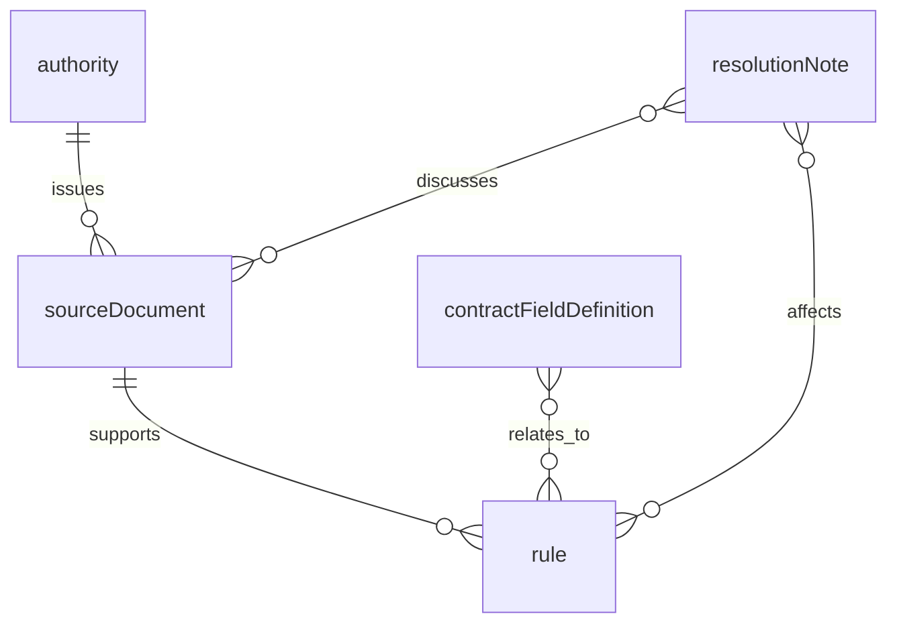

# WazehTerms — Persistent Content and Runtime Data Schema

**Status:** Proposed schema contract for the accepted MVP architecture; no schema deployment is claimed  
**Scope:** Sanity Content Lake holds reviewed reference content only. There is no application SQL database or user-case collection in the MVP.  
**Related:** `PRD.md`, `ADR.md`, `TECHNICAL_ARCHITECTURE.md`; exact API JSON belongs in `API.md`, editorial source records and review procedure in `SOURCES.md`.

## 1. Three distinct data layers

| Layer | Contents | Persistence and authority |
| --- | --- | --- |
| **Sanity Content Lake** | `authority`, versioned `sourceDocument`, `rule`, `contractFieldDefinition`, `resolutionNote`. | Persistent curated reference records. Approved records and pinpointed official sources are the canonical input to rule checks. No worker documents or reports. |
| **Sanity Knowledge Base / Context MCP** | Generated entries built from a narrow approved-record projection and optional vetted source files. | Rebuildable retrieval index. Useful for candidate discovery, **not** a canonical rule database; generated entry paths and summaries are not stable legal IDs. |
| **Application runtime** | Uploaded bytes, extracted fields, signed review payload, correction deltas, comparison candidates, report. | Transient in API memory and active browser memory. Not persisted to Sanity or an application database. Final response shapes are defined in `API.md`. |

The Content Lake schema is implemented in Sanity Studio; it is not a relational DDL file. Sanity documents that Studio schema validation does **not** constrain writes made through its API or import tools. Therefore publishing scripts, the runtime canonical-rule reader, and corpus/build checks must enforce the invariants below independently of Studio. See [Sanity schema validation and the Content Lake](https://www.sanity.io/docs/content-lake/schema-validation-and-the-content-lake).

## 2. Shared vocabulary and identity

### Controlled values

| Concept | MVP values | Rule |
| --- | --- | --- |
| `jurisdiction` | `PK`, `AE`, `international` | A concrete rule concern must select the applicable national jurisdiction; `international` is guidance only. |
| `employmentRegime` | `uae_mainland_private`, `unknown`, `other` | Only `uae_mainland_private` is claimable under UAE MVP rules; `unknown` or `other` is never broadened into it. |
| `workerCategory` | `non_domestic`, `domestic`, `unknown` | Only `non_domestic` is supported for UAE rule concerns. Add narrower categories only with a reviewed source and migration. |
| `party` | `worker`, `uae_employer`, `pakistan_recruiter`, `other`, `unknown` | Responsibility is specific to the cited rule; never merge Pakistan fees with UAE employer costs. |
| `reviewStatus` | `draft`, `approved`, `rejected` | `approved` is explicit editorial approval, distinct from Sanity's published/draft mechanism. |
| `recordStatus` | `current`, `superseded`, `historical`, `withdrawn` | Only `current` can be used for a new current rule concern, subject to its effective period. |
| `evidenceClass` | `binding_official_rule`, `official_guidance`, `international_guidance` | Wording and permissible use depend on class. International material never establishes national law. |

These values define the **initial** supported route, not universal legal taxonomy. A document's applicability state (`supported`, `conflicting`, `unknown`) is a transient analysis result, not a mutable property of an official source.

### Identity and versions

- `authorityKey`, `sourceKey`, `ruleKey`, `fieldKey`, and `resolutionKey` are stable opaque identifiers, independent of titles and Sanity-generated `_id`s. Never reuse a key for a different subject.
- `sourceDocument` identifies one **source version** with unique (`sourceKey`, `versionKey`). When official text materially changes, create a new version record; preserve the previous record and link its successor. Changes to a URL's text are not silently treated as the same reviewed version.
- `rule` has stable `ruleKey` and integer `revision`, unique together. A materially changed claim, scope, condition, trigger, pinpoint, or cited source creates a **new rule document** at revision +1 and requires approval. Preserve the prior approved revision as a superseded document; only its status/lineage metadata may be updated. A new rule key is needed if the proposition itself becomes a distinct rule. Runtime checks use the one approved current revision and its versioned source reference.
- Every record has `schemaVersion` for content migration. The application rejects unsupported versions rather than guessing at renamed fields.
- Uniqueness of natural keys, exactly one approved current revision per rule key, and reference integrity must be checked by a content-validation script or constrained editorial workflow; ordinary Studio validation alone does not make keys globally unique or prevent bad API imports.

## 3. Sanity relationships

The issuing authority of a `sourceDocument` is a strong Sanity reference. Each claimable `rule` references **one exact source version** and includes its own pinpoint; a claim needing multiple authorities can use linked supporting sources but must designate a primary source and check each material dependency. `resolutionNote` records editorial handling of conflict; it cannot silently waive an exception or transform guidance into law.

## 4. `authority`

One issuing organization or institution. Classifying an authority does not by itself establish the legal weight of every document it issues.

| Field | Type | Required for approval | Meaning / checks |
| --- | --- | --- | --- |
| `authorityKey` | string | Yes | Stable unique key, e.g. `mohre`; not a mutable display title. |
| `name`, `shortName` | string | `name` yes | Official English name and optional familiar abbreviation. |
| `jurisdiction` | enum | Yes | `PK`, `AE`, or `international`. |
| `authorityType` | enum | Yes | `government`, `intergovernmental`, or `other_authorized`. |
| `officialDomains` | string[] | For web citations | Hostnames verified during curation; do not infer that *any* URL on a domain supports a claim. |
| `officialHomepage` | URL | Optional | Informational link, not a substitute for a source pinpoint. |
| `reviewStatus`, `reviewedAt`, `reviewerCode` | enums/date/string | Yes | Public-safe editorial approval metadata; no secrets or worker identity. |
| `schemaVersion` | integer | Yes | Content representation version. |

An `authority` may issue sources of differing legal weight; `sourceDocument` and `rule` carry the evidence classification.

## 5. `sourceDocument`

An identified **version** of one official or explicitly authorized source. This is reference material, not an uploaded employment document.

| Field | Type | Required for approval | Meaning / checks |
| --- | --- | --- | --- |
| `sourceKey`, `versionKey` | string, string | Yes | Stable source family and distinct reviewed version; pair unique. |
| `title` | string | Yes | Official or faithfully recorded document/page title. |
| `issuer` | reference → `authority` | Yes | Must resolve to an approved authority. |
| `jurisdiction`, `evidenceClass` | enums | Yes | Match issuer and source role; international guidance cannot be a binding national rule. |
| `officialUrl` | HTTPS URL | Yes for rule evidence | Direct public authority/source URL where reasonably possible; no search-result or third-party mirror as sole evidence. |
| `authorizedFile` | Sanity file reference | Optional | Only an approved public/authorized PDF or equivalent; never a worker upload. Keep the official URL even when an official PDF is imported. |
| `sourceKind` | enum | Yes | `law`, `regulation`, `official_guidance`, `international_guidance`, or `other_authorized`. The kind describes the material's role, not its file extension. |
| `mediaType` | enum | Yes | `web_page`, `pdf`, or `other`; independent of `sourceKind`, so a regulation can be a PDF. |
| `publicationDate`, `effectiveFrom`, `effectiveTo` | date or null | When established | These are distinct; unknown is null, not an invented date. Source-wide dates do not replace rule-specific temporal review. `effectiveTo` is exclusive if set. |
| `retrievedAt`, `lastVerifiedAt` | datetime | Yes | When content was obtained and when the official URL/pinpoint was last checked. |
| `contentHash`, `versionNote` | string | Hash for stored snapshot; note if ambiguous | Digest of reviewed bytes when a stable PDF/snapshot exists; a live webpage may require a dated change note instead. |
| `applicableRegimes`, `applicableCategories` | enum arrays | Yes | Scope supported by the source; avoid treating broad guidance as a universal rule. |
| `recordStatus`, `reviewStatus` | enums | Yes | Only approved/current source versions support new current concerns. |
| `supersededBy` | reference → `sourceDocument` | When superseded | A version change should preserve lineage. |
| `reviewedAt`, `reviewerCode`, `schemaVersion` | datetime/string/integer | Yes | Editorial audit metadata, public-safe. |

If an official page changes, first review its actual claim and pinpoint, then decide whether to create a successor version and update affected rules. Rechecking a URL without finding a change may update `lastVerifiedAt`; it must not erase evidence of a material previous version. A broken or changed official URL blocks affected rule concerns until reviewed.

## 6. `rule`

One narrow, reviewed proposition relevant to a contract term. This is the canonical rule object read after MCP candidate discovery, not free-form instructions for an agent.

| Field | Type | Required for approval | Meaning / checks |
| --- | --- | --- | --- |
| `ruleKey`, `revision`, `title` | string/integer/string | Yes | Stable ID, increasing revision, descriptive title; one Sanity document per revision. |
| `claimText` | short text | Yes | Narrow statement whose wording does not exceed the cited passage. Keep condition and actor explicit. |
| `topic`, `relatedFieldKeys` | enum/string[] | Yes | Topic such as pay, worker costs, working time; field keys must exist. |
| `triggerKey` | controlled string | Only for automated concern | Must match a **code-defined and tested** trigger; no executable expression authored in Studio. A null key makes the record informational/guidance only. |
| `ruleKind` | enum | Yes | `obligation`, `prohibition`, `entitlement`, or `guidance`. |
| `evidenceClass` | enum | Yes | Matches the primary source. Guidance wording cannot assert a statutory violation. |
| `jurisdiction`, `origin`, `destination` | enums | Yes | `PK` or `AE` rule and the supported Pakistan → UAE route. |
| `employmentRegime`, `workerCategory`, `responsibleParty` | enums | Yes | Explicit applicability and responsible actor; no `unknown` for a claimable rule. |
| `conditions`, `exceptions` | text arrays | Yes, even if empty | Human-readable source-grounded qualifications; empty means reviewed as none relevant, not unexamined. |
| `machineConditionKeys` | controlled string[] | When a conditional automated concern is allowed | Each required condition must map to a tested code predicate. If a necessary exception cannot be checked, withhold the concern. |
| `effectiveFrom`, `effectiveTo` | date or null | For dated binding rule | Rule-specific start inclusive/end exclusive; `null` end means no known end. Missing verified temporal applicability blocks a binding rule concern. |
| `currentGuidanceVerifiedAt` | datetime or null | For current official guidance without formal effective date | May support only carefully worded official-guidance concerns while current status is verified. |
| `primarySource` | reference → exact `sourceDocument` version | Yes | Must resolve to approved/current source of matching evidence class. |
| `pinpoint` | object `{label, page?, clause?, quote}` | Yes | Official section/clause or page and a short reviewed exact passage supporting `claimText`; avoid a bare URL. |
| `supportingSources` | references[] | Optional | Additional source versions; these cannot contradict the primary source without a reviewed resolution. |
| `plainEnglish`, `plainUrdu` | short text | English yes; Urdu only if validated | Explanations; Urdu availability does not activate the public Urdu feature gate. |
| `sourceCheckedAt`, `reviewedAt`, `reviewerCode` | datetimes/string | Yes | Pinpoint and claim verification dates/reviewer. |
| `recordStatus`, `reviewStatus`, `schemaVersion` | enums/integer | Yes | Runtime acceptance gate and migration version. |
| `supersededBy`, `resolutionNotes` | references | When applicable | Trace changed rule and documented disagreements. |

Rules built from **international guidance** have no automated national-law trigger and may be displayed only as labelled guidance. An `official_guidance` rule may say what a government agency advises; it cannot be phrased as a violation of a binding provision unless a separate, applicable binding source supports that claim. For a source-backed concern, the API validates trigger, evidence, actor, scope, conditions, source version, status, and temporal applicability. A `reviewStatus: approved` flag alone is insufficient.

## 7. `contractFieldDefinition`

Stable display and extraction metadata for the 12 field groups and their granular components. Code owns normalization/comparison semantics; editors cannot deploy new comparison behavior through Sanity content.

| Field | Type | Required for approval | Meaning / checks |
| --- | --- | --- | --- |
| `fieldKey`, `groupKey`, `label` | strings | Yes | Stable component key, one of 12 group keys, English label. |
| `valueKind` | enum | Yes | `text`, `money`, `date`, `duration`, `benefit_state`, `charge`, `boolean`, or `reference_text`. |
| `acceptedLabels` | string[] | Optional | Extraction hints such as “basic wage”; not proof that a field occurs in a document. |
| `comparisonStrategyKey` | controlled enum | Yes | Selects a code-implemented strategy; no dynamic code, expression, or model instruction. |
| `importantIfAbsent` | boolean | Yes | Candidate missing-information prompt only when readable coverage supports absence. Does not itself declare a legal requirement. |
| `relatedRuleTopics` | string[] | Optional | Helps generate sanitized MCP topics; does not authorize any rule finding. |
| `recordStatus`, `reviewStatus`, `schemaVersion` | enums/integer | Yes | Keep content compatible with code registry. |

The initial stable keys below map the PRD's **12 groups** to independently evidenced components. Repeating `allowance_item` and `deduction_item` values are arrays of individually evidenced components; a monetary component carries its *own* currency, amount, and frequency where stated.

| `groupKey` | Initial `fieldKey` components |
| --- | --- |
| `employer` | `employer_name` |
| `occupation` | `job_title` |
| `location` | `work_location` |
| `pay` | `basic_salary`, `allowance_item`, `stated_total_pay`, `payment_frequency` |
| `term` | `start_date`, `contract_duration`, `renewal_terms` |
| `probation` | `probation_period` |
| `working_time` | `ordinary_hours`, `overtime_terms` |
| `ending_terms` | `notice_terms`, `termination_terms` |
| `deductions` | `deduction_item`, `other_worker_charge` |
| `recruitment_and_travel_costs` | `recruitment_cost`, `visa_cost`, `residency_cost`, `medical_cost`, `travel_cost` |
| `benefits` | `accommodation_benefit`, `food_benefit`, `transport_benefit`, `medical_benefit`, `return_ticket_benefit` |
| `document_details` | `document_language`, `signature_presence`, `document_date`, `document_reference`, `verification_reference`, `annex_reference` |

An item belongs in `deductions` when the document describes a wage withholding or other worker charge without a more specific category; a named recruitment, visa, residency, medical, or travel cost belongs in its specific cost field instead, with its **stated payer**. `signature_presence` records only whether a signature appears, not authenticity. `verification_reference` records stated identifiers or instructions, not a completed verification; unnecessary personal ID values should not be extracted into this field.

The code-defined registry is the authority for which components are actually extracted, normalized, compared, and shown in a particular release. A new field definition must be accompanied by runtime schema, UI, comparison tests, and a schema-version review before activation. A content edit cannot silently widen the public product promise.

The code registry also marks four `document_details` metadata components (`document_date`, `document_reference`, `verification_reference`, `annex_reference`) as **expected to differ** between an offer and a contract: each document carries its own identifier, issuance date, or annex pointer, so a difference in these fields is metadata, not a term difference, and is never emitted as a `document_mismatch` (comparison policy, release-polish WI-1). `signature_presence` and `document_language` stay must-match fields.

## 8. `resolutionNote`

A documented editorial decision for conflicting or superseded claims; it records reasoning and review history without becoming a self-authorizing rule.

| Field | Type | Required for approval | Meaning / checks |
| --- | --- | --- | --- |
| `resolutionKey`, `title` | strings | Yes | Stable ID and concise conflict summary. |
| `affectedRules`, `affectedSources` | references[] | Yes, at least one each where relevant | Exact records and versions considered. |
| `claimsInConflict` | text[] | Yes | Source-attributed statements rather than an unlabeled summary. |
| `selectedTreatment`, `reasoning` | text | Yes | For example, withhold an automated concern or retain separate dated claims. This is a reviewed editorial treatment, not legal adjudication. |
| `reviewedAt`, `reviewerCode`, `nextReviewAt` | datetime/string/date | Yes, next review if needed | Public-safe provenance. |
| `reviewStatus`, `schemaVersion` | enum/integer | Yes | Draft notes do not resolve production conflicts. |

If the conflict changes applicability or exact claim wording and no approved resolution is valid, affected rules remain ineligible for automated source-backed concerns. Avoid adding private worker or employer information to a note, especially if the dataset is public.

## 9. Eligibility checks and Knowledge Base input

**Editorial publish gate:** A reviewer checks identity, source URL and version, pinpoint, scope, actor, dates, conditions/exceptions, evidence class, and cross-record references; only then marks a record approved and publishes it. A substantive change to a previously approved rule/source version creates a new revision/version and requires fresh approval; do not overwrite its reviewed claim or source text. Any programmatic content import performs the same checks in code. A post-import validation pass detects missing references, duplicate key+version pairs, and multiple approved/current rule revisions with the same `ruleKey`.

**Knowledge Base dataset source:** Select only published, approved, current reference records and project a minimal but traceable set of fields such as `ruleKey`, `revision`, claim text, topic, conditions, primary source ID/version, official URL, and reviewed pinpoint. This is a Sanity dataset **feeding a Knowledge Base**, not a dataset source attached to the agent's MCP endpoint. Additional vetted official PDFs may be separate KB file sources; uploaded KB files do not automatically resync when the official PDF changes. Generated KB entries can paraphrase or rearrange material; the API must re-read canonical approved records before a concern is displayed. See [Knowledge Base source types](https://www.sanity.io/docs/ai/sanity-context-source-types).

**Runtime eligibility:** Require exactly one matching current `ruleKey`/revision or an unambiguous source/pinpoint mapping; a compatible, current primary source version; an allowed evidence class and `triggerKey`; verified pinpoint; matching jurisdiction, regime, category, party, dates, and conditions. Suppress the claim for an unresolved contradiction, a stale KB revision, a malformed record, a missing mandatory condition, or an unsupported schema version.

**Content release:** A dataset edit may require a KB refresh and applying issues, or a full rebuild when Sanity indicates one. A refresh alone can leave older entries served until its issues are applied; check the generated entry and run a known-answer MCP query before activating a changed rule. Record content release or check dates without adding operational secrets to the public dataset. See [Knowledge Base maintenance](https://www.sanity.io/docs/ai/sanity-context-maintain-knowledge-base).

## 10. Transient schema: what is deliberately not a Sanity document

| Runtime type | Important fields | Storage rule |
| --- | --- | --- |
| `IncomingDocument` | Opaque document ID, declared role, detected type, bytes, page count, digest. | Process only for the active extraction; no user uploads in Sanity. |
| `ExtractedField<T>` | Field key; state `present/absent/unclear/unreadable`; raw text; typed value; component-level `{documentId, page, quote, verificationState}` evidence. | Signed original extraction is returned to browser memory; not a persistent row. |
| `UserCorrection<T>` | Field key, corrected value, `suppliedBy: user`, optional user note. | Separate from the signed original; does not create verified evidence. |
| `IssuedExtractionV1` | Schema version, scope, document IDs/digests, original extraction, issue/expiry, HMAC. | Browser memory only during active review; HMAC secret remains server-side. |
| `AnalysisReport` | Finding categories, coverage and stage statuses, supported source version/pinpoint, review date, limitations, next questions. | Returned to browser; no server-side case history. |

The final `API.md` should specify JSON schema and validation for these objects. This document intentionally does not invent SQL tables such as `users`, `cases`, `documents`, or `analysisLogs`. Adding persistent case storage or real-document collection would require a new ADR, privacy design, data model, retention policy, and access controls.

## 11. Schema acceptance checklist

1. Seed one official Pakistan source, one official UAE source, appropriate authorities, five reviewed example rules, and the 12 field groups with granular components. No fictional legal proposition is presented as a real approved rule.
2. Attempt invalid API/import records to prove that the **application content gate**, rather than Studio alone, catches missing pinpoints, duplicated keys, bad references, mismatched evidence class, and unsupported revisions.
3. Build the KB from the approved projection; verify its generated entry maps back to the exact canonical rule revision or a unique reviewed pinpoint through MCP.
4. Supersede a source version: an old rule cannot support a current concern; a replacement requires a newly approved revision and an updated KB entry.
5. Confirm Sanity and its asset store contain no worker documents, user corrections, or analysis reports. Inspect dataset visibility and content before any public release.
