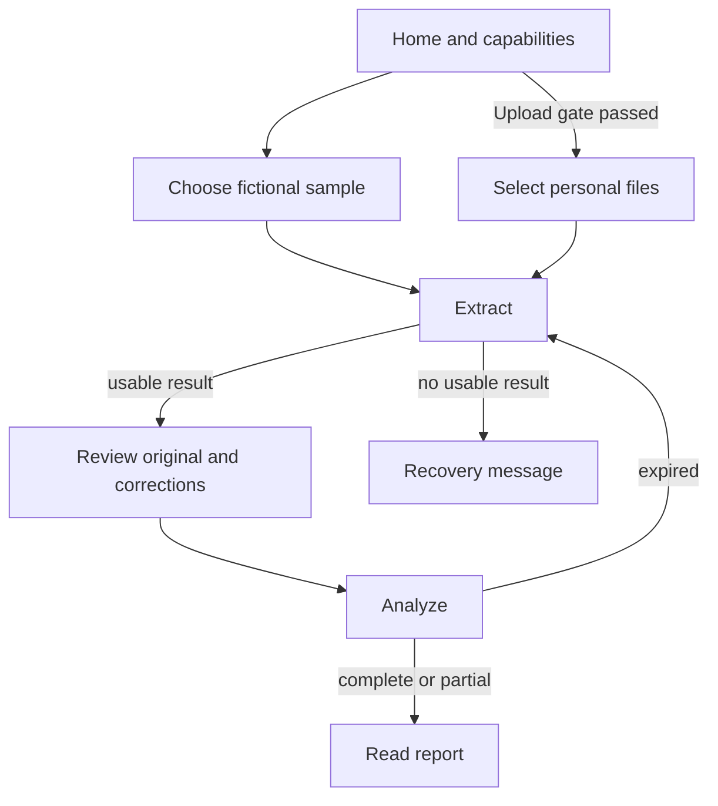

# WazehTerms — Frontend Specification

**Status:** Agreed MVP interface design for implementation; no UI or live behavior is claimed to exist yet  
**Scope:** Public React + TypeScript web client on the same Cloud Run origin as the Express API. Sanity Studio is an editor tool and is outside this interface.  
**Authority:** `PRD.md` defines the product promise, `ADR.md` the accepted decisions, `API.md` the request/response shapes, `DATABASE_SCHEMA.md` the active field keys, `SOURCES.md` source interpretation, `SECURITY.md` sensitive-data handling, `TESTING.md` acceptance evidence, and `DEPLOYMENT.md` enabled release flags. This document owns screen behavior, layout, copy rules, and client state; it does not revise those contracts.

## 1. Experience in one sentence

Help a person considering a job in the UAE inspect **what their written offer or contract says**, correct an extraction before analysis, and read concrete differences and source-checked concerns without receiving a legal or document-authenticity verdict.

The first public experience is a **sample-only demonstration** with five fictional cases. `GET /api/v1/capabilities` controls what is actually offered: custom file upload, JPG/PNG, and Urdu explanation each require separate release gates. No visible upload affordance should suggest a personal document can be submitted when `customUploadEnabled` is false. The supported legal-rule route is Pakistan → UAE **mainland, non-domestic private-sector employment**, only when applicability is established. A person's route selection is a declaration to check, not proof.

### Product language invariants

- Use **review**, **written terms**, **difference**, **question**, and **source-backed concern**. Do not call the product an employer verifier, fraud detector, visa checker, legal adviser, or authenticity checker.
- Show **“No concern detected in the fields checked”** only when all relevant checks completed and the report has no flagged concerns. Never use “safe,” “legal,” “fraudulent,” “fully compliant,” or a green all-clear score.
- Distinguish **document evidence**, **model transcription**, and **your correction** wherever relevant. A correction cannot become an original quotation or a confirmed document mismatch by display treatment.
- A source concern has a reviewed official URL and pinpoint; a document difference can exist without any legal rule claim. Label official explanatory guidance as such; international material is separately labelled supplementary guidance.
- Partial results identify unfinished stages and omitted checks near the top, not in footnotes. An absent term is not an explicit denial, and a scanned unreadable page is not evidence of absence.
- User-facing strings must be plain English at launch. Do not display a dormant Urdu switch or unsupported image-picker hint. Preserve English passages, numbers, scope, citations, and uncertainty if Urdu is enabled after testing.

## 2. Information architecture and navigation

| Suggested client view | Purpose | Access and recovery |
| --- | --- | --- |
| `/` Home | Explain scope, demo action, process, privacy link, limitations. | Always public. |
| `/examples` Sample choice | Five allowlisted fictional examples with fixed document previews and descriptions. | Available only if `sampleModeEnabled`; a case opens using its `sampleCaseId`. |
| `/start` Personal document intake | Route/category declaration, offer/contract pickers, processing notice. | Offer this navigation only when `customUploadEnabled`. Direct visits while disabled explain the gate and point to samples; never show an active file picker. |
| `/review` Extraction review | Compare original page and extracted fields, record corrections. | Requires the in-memory issued extraction and proof; a refresh/direct visit returns to a safe starting view with an explanation. |
| `/result` Findings | Display the returned analysis, coverage, evidence, official links, and next questions. | Requires the in-memory report; there is no report ID or server fetch to rebuild a lost view. |

These paths are **suggested frontend routes**, not additions to `API.md`. Express must reserve `/api/*` before the SPA fallback. Document bytes, selected filenames, signed extraction, corrections, report text, and evidence never appear in path segments, query strings, hash fragments, or client-side storage. Internal transitions can keep focus and scroll location but cannot create a shareable personal-case URL.

Header on desktop: WazehTerms wordmark at left; **How it works**, **Privacy**, and **Sources** at right. On narrow screens, keep the brand and a simple accessible navigation menu. No account, sign-in, saved-case, Sanity Studio, or authority-logo endorsement link in the public header. Footer: product limits, provider/privacy notice link, source-policy link, and a plain statement that official help may still be needed.

## 3. Visual direction and layout tokens

Use a calm, practical service style: warm off-white canvas, white reading surfaces, dark ink, restrained deep teal actions, and an amber treatment for incomplete checks. Do not use alarm-red for every mismatch; reserve it for an actual form or system error. Use one restrained document illustration on the homepage, labelled fictional, and small functional icons elsewhere. Do not reproduce official UAE/Pakistan seals or visual marks that imply government affiliation.

| Token | Initial specification | Usage |
| --- | --- | --- |
| Canvas / surface | `#F7F8F4` / `#FFFFFF` | Page and cards. |
| Text / secondary text | `#173438` / `#435B60` | Main reading and metadata; test each actual pairing. |
| Primary / primary-on | `#075E57` / `#FFFFFF` | Main button, links with visible affordance, focus treatment. |
| Source-information surface / text | `#EAF4F0` / `#164D50` | Clearly labelled official-source information; color alone carries no meaning. |
| Incomplete surface / text | `#FFF4DB` / `#70460C` | Partial review or pending verification. |
| Error surface / text | `#FFF0ED` / `#9B2C2C` | Blocking input/technical errors. |
| Radius and spacing | 10–14 px corners; 4/8/12/16/24/32 px spacing scale. | Consistent grouping without dense dashboards. |
| Typography | Bundled or system sans-serif with a readable fallback; 16 px minimum body; approximately 1.5 line height; 28–40 px responsive hero headline. | Avoid long all-caps labels, tiny footnotes, justified text, or text over illustrations. |

The proposed foreground/background text pairs above pass a preliminary contrast calculation above 4.5:1; verify final hover, disabled, border, focus, and icon pairs in the actual rendered UI. Aim for [WCAG 2.2 AA](https://www.w3.org/TR/WCAG22/) and accessible form guidance. Use text labels and shapes as well as color for every state.

At approximately `min-width: 900px`, the home hero and intake page may use two columns; review uses a resizable or fixed **document pane ~55% / field pane ~45%**, with each pane scrollable without trapping keyboard focus. Constrain normal reading content to ~1,160 px and text paragraphs to comfortable line lengths. Between ~600 and 899 px, prefer stacked panels or a selectable preview pane rather than cramped half-width PDF text. Under ~600 px, use a single column with 16 px side padding and large buttons; do not force horizontal page scrolling. Allow the browser to zoom to 200% and reflow without hiding evidence or actions. Breakpoints are design starting points; adjust after device and zoom tests.

## 4. Screen specifications

### 4.1 Home

**Above the fold, desktop:** left hero with scope eyebrow **Pakistan → UAE mainland private-sector job offers**, heading **Understand your job offer before you sign**, two short sentences about checking written terms and seeing original wording, and a primary **Try a sample review** button. To its right, show a small visibly fictional two-document salary excerpt illustration marked **Illustrative example**. Below the button show “No account needed.” In sample-only mode, say **Personal document upload is not available yet** in ordinary text; do not render an enabled Upload button.

**Once upload is enabled:** replace the primary action with **Review my documents**, and place **Try a sample** beside it. Render this from capabilities on each new page load, not from a build-time assumption. If capabilities cannot load, show a retry state and keep restricted modes closed rather than guessing a flag.

**Below the fold:** a three-step strip (Choose a sample or document → Check extracted terms → Read evidence-backed findings), three concise benefit explanations (see source wording, compare explicit terms, identify questions), a **What this does not check** panel, and links to provider/privacy and source information. Do not promise a guaranteed processing time or current legal coverage beyond approved sources. On mobile, stack hero text, action, illustration, steps, and limits in that order; the CTA is full width.

### 4.2 Choose a fictional sample

Header **Explore a fictional example**, explanation that all names/employers are invented, and a note that pressing the action sends the chosen fictional documents to Gemini for extraction. Render only IDs/metadata returned by `GET /api/v1/samples`, reconcile with `sampleModeEnabled`, and never construct a file path from user input. Cards use available API titles/descriptions; the target five cover a consistent pair, salary/benefit difference, worker-charge question, missing/conditional term, and abstention. Do not imply every sample has a source-backed finding.

Desktop: grid of two or three cards, each with **Fictional sample**, document-role chips, a sentence about the scenario, **Preview files** and **Review this sample**. Mobile: one card per row, actions large enough for touch. Preview loads only API-provided fixed same-origin `/samples/...` URLs and identifies each as offer or contract. Starting sends `{sampleCaseId}` to `POST /api/v1/extractions`; the server manifest supplies scope and bytes. No editable scope/file selector in this mode. If a preview fails, explain the preview problem without assuming extraction is impossible; disable a case only if its actual sample is unavailable.

### 4.3 Personal-document intake (gated)

When enabled, header **Start a document review** and a compact step label **1. Documents → 2. Check terms → 3. Findings**. Two-column desktop layout: left task form, right **Before you continue** panel; on mobile, stack the right panel before the final action.

1. Show the supported route **Pakistan → UAE** as fixed text. If the visitor needs another route, say it is not supported here; do not send an invented country code. Ask **Which employment category do you expect?** with `UAE mainland private sector`, `Not sure`, and `Another category`, mapping to `declaredRegime`. Ask **Is this domestic work?** with `No`, `Yes`, and `Not sure`, mapping to `declaredWorkerCategory`. Do not preselect the supported answers. Explain that a non-supported/uncertain declaration can still produce limited document terms or comparisons but may withhold mainland rule claims; the server determines actual applicability using document clues.
2. Present separate **Job offer** and **Employment contract** file selectors. Each is optional alone; require one or both together and no duplicate role. After selection show local filename, file type and size, **Preview**, and **Remove/Replace**. Do not infer role from filename. An offer-only or contract-only selection triggers: **We can review its terms, but cannot compare an offer with a contract.**
3. Show accepted types, actual per-file/total byte and PDF page caps from `/api/v1/capabilities` beside the selectors; file-size checking is a quick client hint, never a replacement for server checks. PDF is the assured tested type. JPG/PNG choices appear only if they are both enabled by the deployed capability contract and validated by the separate image gate; never hardcode a visual promise from an extension alone.
4. The right panel explains that document content goes to Gemini, advises removing unnecessary identifiers, links to the full live provider-processing notice (`privacyNoticeVersion`), and states that this is not employer/visa authentication. When real uploads are enabled, require an explicit, unticked acknowledgment of the reviewed processing notice before **Extract terms**; this acknowledgment belongs to the active form only and is not an invented stored consent record. If the actual provider notice has not been approved, the gate must remain closed.

On submission, disable repeated clicks and show a truthful sending/processing state. Server rejection can override any optimistic client check. A user can replace a file and retry after a 413/415/422 response. If the server answers `403 CUSTOM_UPLOAD_DISABLED` after the page loaded, show the updated availability message, discard the pending upload, and offer fictional samples; never retry the blocked upload automatically.

### 4.4 Extraction progress

Full-width focused panel **Reading the documents** with selected fictional sample title or roles (avoid repeating personal filenames unnecessarily), a spinner with a text status, and a short explanation that the next step is user review. This API call is synchronous: the client knows only **request pending**, **response received**, or **request failed**; it must not display fabricated page-by-page progress, a percentage, or internal Gemini/Sanity stage completion. Show a cancel/reset action only if it actually aborts the client request and clears local state; the server attempts cancellation where supported. A returned partial extraction opens review with a prominent incomplete-page notice; if there are no usable fields (`422`), show a recovery action instead of a blank review.

### 4.5 Review the extracted terms

Header **Check what we read**, one-line instruction **Compare each value with the original page. Your changes remain labelled as yours.** Show the document roles, extraction coverage, unreadable-page note, and a warning before the server-provided `expiresAt`; after expiry, ask for fresh extraction. Use relative wording (“Review expires soon”) plus a date/time if displayed; no locally guessed fixed TTL.

**Desktop:** document preview on the left (~55%), field list on the right (~45%). Offer/contract tabs appear only for roles present; page navigation is one-based. A field's **View page** focuses its evidence page and attempts a text highlight if the PDF rendering library can locate it; where it cannot, still open the stated page and show the reported excerpt in the field card. Do not render an unverified transcription as a verified highlight. Preview the selected local File/Blob via a revocable object URL, or a fixed same-origin sample preview URL. Never display the HMAC signature or digest in the UI.

**Field pane:** group the active `DATABASE_SCHEMA.md` keys under the 12 groups in their document context: employer, occupation, location, pay, term, probation, working time, ending terms, deductions, recruitment and travel costs, benefits, and document details. Show user-friendly headings, with state counts and “Needs your check” items at the beginning; expanding a group reveals each component and repeated allowance/deduction `instanceId` separately. Use the code field registry plus approved `contractFieldDefinition` labels as suitable; content cannot silently add a field unknown to the API registry. Do not display a misleading overall completion percent based only on the number of present fields.

**One component card** shows its selected document role, state label (`Found in document`, `Not found on readable pages`, `Unclear`, `Could not read`), original raw wording, typed amount/currency/frequency/benefit state as appropriate, each passage with **Page N**, evidence quality (`Text matched to PDF` for `matched_text`; `Model transcription—check the page` for `model_transcription`), and quality notes. Treat quote text as escaped plain text. Missing, unclear, and unreadable states receive distinct language. For cost fields show the stated payer if known; never infer who must pay.

**Correct value** opens an inline form adapted to the `NormalizedValue.kind`: text, decimal amount as a string plus currency/frequency/payer selectors, date, duration, benefit state and conditions, or boolean presence. Prefill from the issued value as a convenience, but save only a separate delta identified by existing `documentId` + `fieldKey` + `instanceId`. Original extraction and page evidence remain visible; afterwards label **Your correction** and **Used for analysis** separately. Permit undo/remove correction. Cap counts and lengths using API rules; never let the UI create a new documentary quote. If the user thinks the file itself is wrong, offer **Start over with a different document**; analysis does not accept replacement bytes.

**Mobile:** fields are the main page; **View document page** opens an accessible full-screen panel or view with a **Back to this field** control preserving field position. Offer/contract and page selectors remain usable, and no split pane forces tiny PDF text. The main action is **Continue to findings** after review. `review: completed` records proceeding through the screen, not independent verification of every passage. One document remains a term review; do not show a “Compare documents” action as if a second file existed.

### 4.6 Analysis progress

Use a second honest pending state: **Comparing written terms and checking sources**. The browser has a single `POST /api/v1/analyses` request; it cannot know the internal retrieval/applicability/explanation stage in real time. Keep the original signed `issuedExtraction` and `proof` untouched in memory and send corrections separately. Prevent double submission. A safe retry may resend the same request while proof is valid (replay is allowed during the TTL); do not claim it is an exactly-once operation. On expiry or unsupported schema, start a new extraction. On a successful `200 partial`, go to the report instead of treating it as a failure.

### 4.7 Findings report

**Top block:** heading **Your document review**, `Complete review` or **Partial review** based on API `status`, date from `reviewedAsOf`, document roles, and applicability wording from `scopeApplicability`. “Supported” means applicability was checked for the defined route; it does not mean the employment offer is safe. `conflicting` or `unknown` shows an explicit limitation and withholds mainland legal-rule wording. Put `limitations`, `coverage.omittedChecks`, and unreadable fields near the top when relevant. A partial review cannot show an all-clear summary.

**Attention navigation:** counts of actual findings under the five API categories, with anchored links to the corresponding cards. Label this **What needs your attention**, not a risk score. The count does not infer severity or legal correctness; `importance` can order items inside a category but never becomes a red/yellow/green legal verdict. Do not render an empty category as a finding. Allow the user to review the full coverage list, including fields checked without a reported issue.

**Cards in reading order:** `document_mismatch` → **Different wording in the two documents** (offer and contract quotations side by side with page and component; two evidence passages required); `source_backed_concern` → **Concern to check against an official source** (document passage, issue, official issuing authority, exact section/page and short official passage, responsible actor, Pakistan/UAE jurisdiction, relevant dates/last source check, direct official link); `missing_information` → **Information we could not find** (only after readable coverage); `needs_clarification` → **Question to clarify** (conditional term, annex, or clearly marked user-reported difference); `unable_to_determine` → **Could not determine** (unreadable or scope/evidence gap). Each card shows a short explanation and `suggestedQuestionOrStep`; a **View original page** control works only while the active preview remains in browser memory.

Render `source.evidenceClass` explicitly as **Official rule** or **Official guidance**, never label a government guidance page a statute. Show source revision/version metadata in a disclosure labelled **Source details** if useful, while keeping the official link and pinpoint visible in the main card. Do not create a source card from model text, an unapproved KB snippet, or a fabricated citation. Render `officialNextSteps` only as server-approved links; external links should explain that the user is leaving WazehTerms.

**Coverage and closing:** a **What we checked** disclosure shows stage statuses (`completed`, `partial`, `failed`, `not_applicable`, `not_started`), checked fields, unreadable fields, and omitted checks in human language. A one-document report labels comparison **Not applicable—only one document supplied**. A failed source check says **We could not complete the source check; document differences below may still be useful.** Finish with **Review another sample** and **Start over**. No accounts, case history, server report URL, built-in sharing of private excerpts, or automatic PDF export in the MVP. If export is added later, add a deliberate local-copy warning and a privacy review.

## 5. Client state and API mapping

An expiry transition means **re-extract the sample or reselect/reupload the still available local file**, never reuse the old proof. The diagram describes views, not extra endpoints. Browser state is transient and scoped to one active case:

| State | Source | Lifetime / client rule |
| --- | --- | --- |
| `capabilities` and sample metadata | `GET /api/v1/capabilities`, `GET /api/v1/samples`. | Fetch on entry; use actual flags and URLs; no private values. Prevent gated action if fetch fails. |
| `scope` and selected file objects / preview URLs | User form or server sample manifest. | Browser memory only. Revoke Blob URLs on replacement/reset/unmount; never use uploaded filenames as paths. |
| `issuedExtraction` (`IssuedExtractionV1`), `proof`, `expiresAt`, extraction notices | `POST /api/v1/extractions`. | Original object is immutable in state; never alter signed fields. Warn/stop at expiry. |
| `corrections` | Local form keyed by `documentId:fieldKey:instanceId`. | Separate bounded deltas; original raw text/evidence unchanged; reset with case. |
| `report` and returned stage/coverage data | `POST /api/v1/analyses`. | Memory only; display `partial` honestly; no shareable ID or report fetch. |

The `API.md` `Evidence.verification` values are `matched_text` and `model_transcription`; do not use a different client-only “verified” flag. The proof is a transport integrity token, not a user-visible confidence badge. For value formatting, do not use floating-point math on money strings, assume missing currency/frequency, silently convert currencies, or translate a source quote. UTC dates can be shown in the user's locale with an unambiguous formatted date; preserve ISO values in application state. The client never calls Sanity or Gemini directly and never contains their credentials.

## 6. Error, empty, and recovery states

| API outcome or condition | User-facing behavior | Action |
| --- | --- | --- |
| Capabilities unavailable | **We could not check which review options are available.** Do not assume custom upload is enabled. | **Try again**; no file selector. |
| `400 BAD_REQUEST` / duplicate role | Identify the intake field or combination that needs correction without echoing private body data. | Fix selection; retry deliberately. |
| `403 CUSTOM_UPLOAD_DISABLED` | **Personal document upload is not available right now.** | Clear pending upload; open examples if available. |
| `413 FILE_TOO_LARGE` / `REQUEST_TOO_LARGE` / `TOO_MANY_PAGES` | State actual limit from capabilities, not an invented cap. | Replace or shorten file; keep safe scope choice. |
| `415 UNSUPPORTED_MEDIA_TYPE` | **This file type is not supported here.** Distinguish extension from detected type if needed without technical dumps. | Choose an enabled format. |
| `422 UNREADABLE_DOCUMENT` | No usable extraction; do not show an empty review as complete. | Replace file or choose another sample. |
| `422 INVALID_CORRECTION` | Highlight offending correction if server identifies it safely; otherwise show a general review-validation message. | Edit/undo correction. |
| `422 REVIEW_INVALID`, `409 REVIEW_VERSION_UNSUPPORTED`, `410 REVIEW_EXPIRED` | **This review can no longer be continued.** No MAC/key detail. | Fresh extraction from the original sample or local files if still available. |
| `429 RATE_LIMITED` / `SERVICE_BUSY` | **The service is busy. Please try again shortly.** Show `Retry-After` only when supplied. | Deliberate retry, never automatic rapid polling. |
| `502` / `503` / `504` without useful report | **We could not finish this review.** Name the failed high-level task without revealing private payloads. | Retry only when appropriate; re-extract if proof expired. |
| `200 partial` | Show a report with explicit incomplete stages and omissions. | Read document findings and official next steps; no all-clear sentence. |

Do not duplicate error alerts on every keystroke. Put field errors alongside labelled controls, a summary at the top for submitted forms, and focus the first blocking error. Do not leak exception stacks, full filenames, excerpts, proof, or upstream responses into user-facing toasts. If browser navigation discards an active review, give an ordinary confirmation that progress will be lost; a reload cannot restore it. `AbortController` may cancel the browser request but is not a guarantee that provider processing stopped.

## 7. Accessibility and content quality

- Use semantic landmarks, one `h1` per view, headings for groups, associated form labels, real buttons and links, clear required/optional labels, visible keyboard focus, and an escape/back path from preview panels. Provide an accessible text alternative for the decorative hero illustration.
- Keep all steps operable by keyboard. On view transitions move focus to the new heading or error summary; returning from mobile PDF preview restores focus to the originating **View document page** button. Avoid focus traps in side panes and distinguish offer/contract tabs with correct tab semantics.
- Announce asynchronous completion and blocking errors with a restrained live region; do not repeatedly announce a spinner or estimated percentage. Group long evidence quotes for screen readers and preserve reading order when the two-column layout stacks.
- Minimum body text is 16 px; target approximately 44 × 44 CSS px for primary touch controls, comfortably exceeding the [WCAG 2.2 AA minimum target-size rule](https://www.w3.org/WAI/WCAG22/Understanding/target-size-minimum). Validate final text contrast against the actual surfaces and ensure zoom/reflow keeps the two evidence passages readable. [W3C form guidance](https://www.w3.org/WAI/tutorials/forms/validation/) informs labels and actionable errors.
- Avoid unexplained abbreviations like MCP/HMAC in product copy. Define **offer**, **contract**, **worker charge**, and **official guidance** in short inline help if needed. Read monetary values with their currency and frequency; date labels distinguish document date, proposed start date, analysis date, and source-check date.
- Do not rely on color, icon, “high risk,” or a numeric confidence percentage to convey certainty. Text should explicitly distinguish what was read, what was corrected, what was checked against an official passage, and what remains unknown.

## 8. Implementation boundaries and acceptance checklist

Suggested React organization: `AppShell` and capability gate; `Home`; `SampleChooser`; gated `DocumentIntake`; `ExtractionPending`; `EvidenceReview` with `DocumentPreview`, `FieldGroup` and `CorrectionEditor`; `AnalysisPending`; `FindingsReport` with `CoverageSummary`, `FindingCard` and `OfficialSourceCitation`; shared `ErrorPanel` and notice components. These are component responsibilities, not a mandated router or state library. Keep the signed original object isolated from editable UI values; reusable rendering components accept already validated API data and escape it. Do not add a second source of truth for field keys or a Sanity client in the public bundle.

Before calling this spec implemented:

1. In sample-only mode the home page and examples work, but no personal-file picker or enabled upload CTA is visible; a direct `/start` visit explains the gate. Five fictional cases are labelled and use their allowlisted server IDs.
2. One sample with two explicit different terms displays two page passages in a mismatch; a single-document sample has no claimed comparison. A user correction leaves the original visible and produces no false confirmed mismatch.
3. Review shows all active field components under the 12 schema groups, including repeated allowances/deductions, distinct states, page evidence, and transcription quality. Keyboard and mobile users can reach and return from the original page.
4. `complete`, `partial`, unreadable, unknown scope, absent term, failed source retrieval, expired proof, invalid correction, and all documented file/limit errors have truthful messages and usable next actions. No partial report displays a positive all-clear.
5. Official-source concern shows the exact issuer, official URL, pinpoint, actor, scope and source-check date actually returned by a verified API report. UI never invents legal claims or upgrades guidance into a statute.
6. No user documents, original extraction, corrections, or report enter browser storage, URLs, analytics, source control, or public Sanity. Reset/replacement revokes local preview URLs; reload loses private state as explained.
7. Capabilities, privacy notice version, accepted formats, English/Urdu availability, public labels, and measured limits match the live API and `DEPLOYMENT.md` release record. Mobile layout, zoom, keyboard, screen-reader labels, contrast, and five production synthetic flows pass the relevant `TESTING.md` checks.

Feature-gate changes require updating this file together with `PRD.md`, `API.md`, `SECURITY.md`, `TESTING.md`, and `DEPLOYMENT.md`. Changing account/persistence behavior or the signed two-step review requires a new ADR before the UI promises it.
