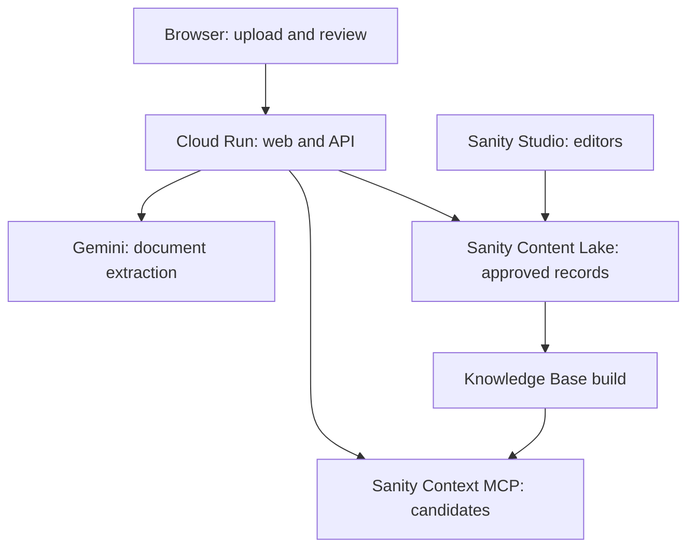

# WazehTerms — Technical Architecture

**Status:** Target MVP architecture; integration and deployment details must be verified against working code  
**Authority:** `PRD.md` defines the product boundary; accepted choices in `ADR.md` constrain this design. `DATABASE_SCHEMA.md` defines the curated Sanity records. Exact HTTP shapes belong in `API.md`.

## 1. Architecture at a glance

WazehTerms is a public, account-free web application for a narrow Pakistan-to-UAE pre-signing document review. The browser retains the active upload and reviewed extraction in memory. A single Cloud Run service serves the React build and the Express API under one origin. The API coordinates Gemini extraction, deterministic comparison, Sanity Context MCP retrieval, a separate read of approved Sanity records, and report assembly. Sanity Studio is an editor surface for public/authorized reference content, never a destination for worker uploads.

The Knowledge Base may ingest a **filtered projection of approved dataset records** and carefully selected official/authorized source files. That dataset source is an *input to the Knowledge Base*. The **agent-facing MCP endpoint attaches only the Knowledge Base**, with no dataset source attached to the endpoint. Sanity selects MCP tool mode from endpoint sources; a dataset source on that same endpoint would select GROQ mode and displace Knowledge Base tools. See [Sanity retrieval modes](https://www.sanity.io/docs/ai/sanity-context-retrieval-modes) and [Knowledge Base sources](https://www.sanity.io/docs/ai/sanity-context-source-types).

## 2. Ownership and trust boundaries

| Component | Owns | Must not do |
| --- | --- | --- |
| React client | Scope choice, privacy notice, local file preview, extraction review, separately labelled corrections, report rendering. | Hold API secrets; store worker documents or signed extraction in URLs, local/session storage, telemetry, or public caches. |
| Express API | Admission limits, schema validation, signed extraction handoff, normalization, comparison, applicability, citation gates, report assembly, cancellation and safe operational logs. | Regard client corrections, document instructions, MCP prose, or Gemini output as trusted commands or verified law. |
| Gemini | Bounded document reading into a typed extraction; optional plain-language phrasing of an already decided finding. | Decide exact mismatches, create a rule claim or citation, set legal applicability, or alter a finding type. |
| Sanity Content Lake | Curated authorities, source versions, reviewed rules, field metadata, and documented source resolutions. | Store worker uploads, extracted personal details, reviews, reports, or raw application telemetry. |
| Sanity Knowledge Base / Context MCP | Read-only candidate discovery from approved reference material. | Serve as the sole final authority for a rule claim, write to Sanity, or receive worker-identifying query text. |
| Sanity Studio | Editorial entry and review of reference records. | Act as a public upload or report-management interface. |

The browser, uploaded files, model output, and retrieval output are untrusted at the API boundary. Sanity records become eligible for an application rule check only after **published + approved + current + reference/version validation**. Studio validation helps editors but is not a server-enforced database constraint; the API and content-publishing checks must validate records again. See [Sanity schema validation behavior](https://www.sanity.io/docs/content-lake/schema-validation-and-the-content-lake).

## 3. Two-step request lifecycle

### 3.1 Extract and return an integrity-bound review

1. **Scope and privacy:** User selects Pakistan → UAE and the intended employment category, reads the provider-processing notice, and supplies an offer, contract, or both. Label bundled samples as synthetic.
2. **Admission:** API checks request size, actual file signature against declared MIME, allowed type, PDF page count, encryption/malformation, limits, and timeout budget. The release gate controls whether JPG/PNG is enabled. Use opaque per-request document IDs; do not use filenames as trusted paths or identifiers.
3. **Extraction:** Send bounded PDF bytes inline to Gemini. Request typed fields and source passages for each document. Validate output against a runtime schema. An invalid response can be retried only within the bounded budget; never silently coerce a malformed result into a complete review.
4. **Evidence check:** Preserve original passages, page numbers, raw field strings, field states, and extraction-quality flags. On a text-layer PDF, attempt to match the reported passage to the claimed page; scans may require visible user review and an `unverified_transcription` flag. Do not call a guessed passage verified.
5. **Handoff:** Create `IssuedExtractionV1` containing the schema version, scope choice, random document IDs, content digests, original validated extraction, issued/expiry times, and evidence-quality flags. Sign a canonical serialization with a server-side HMAC key. Return the payload and signature over HTTPS. The browser retains them only in memory and keeps a local file object for preview. No server session or raw document is needed for the next step.

The content digest binds the issued result to the bytes processed. It is not a document-authenticity check and is not persisted or logged. The signed payload contains sensitive excerpts; **HMAC gives integrity, not confidentiality or user authentication**. Set a short expiry, size ceiling, and signing-key rotation policy in `API.md`/`SECURITY.md`. A refresh loses the active review and requires re-upload.

### 3.2 Analyze the reviewed result

1. **Verify:** Check bounded request size, signature, expiry, schema version, payload integrity, supported scope, and correction shapes. Invalid handoffs fail explicitly; a user cannot send a newly invented “original quote” by changing the signed object.
2. **Reconcile:** Keep the original extraction immutable. Apply user corrections as separate values with `suppliedBy: user`; show the source and effective comparison values side by side. If a correction lacks corroborating document evidence, any resulting difference is user-reported or needs clarification, not a confirmed documentary mismatch.
3. **Normalize and compare:** Application code handles salary components, currencies, frequency, dates, job and location text, benefit states, named payer, and conditional wording. A comparison requires two sufficiently readable documents. For one document, skip comparison but continue a term review and appropriate source questions.
4. **Classify coverage:** Determine `supported`, `conflicting`, or `unknown` worker/regime applicability from the user choice plus evidence. Missing pages, ambiguous roles, unseen annexes, and unknown actor/date stay explicit. A mainland rule claim requires established applicable facts; the system does not infer the regime from a logo or address.
5. **Retrieve candidates:** Generate a minimal MCP query from topic, jurisdiction, worker category, responsible actor, and review/effective date. Do not send a name, raw clause, image, passport number, or the full extraction to Sanity. The server-side MCP client calls the Knowledge Base endpoint in a bounded tool loop; both tool inventory and a known-answer read are verified in deployment.
6. **Resolve and gate:** A candidate must map unambiguously to an approved canonical `rule` and versioned `sourceDocument`, ideally by stable rule ID and revision. If a generated entry omits these, matching by reviewed official source/pinpoint is possible only if unambiguous. Check claim, quote, issuer, URL, worker scope, actor, conditions/exceptions, temporal validity, status, and source-check date. If mapping or an essential check fails, suppress the rule claim.
7. **Explain and assemble:** Construct findings from approved facts. Deterministic explanation templates should cover simple comparisons; an optional Gemini phrasing call may receive a minimal, already-classified finding with unnecessary identifiers removed. Validate its output against the established category, values, source, and uncertainty. Assemble the original passages and canonical citation **in server code**, then return a structured report with stage coverage.

The report is assembled from evidence and decisions; it is not a raw model completion. A source-backed concern cites an official passage that has been reviewed in the curated record. A source URL and pinpoint reflect the **last verified source version**, not a guarantee that an external page is still unchanged at the moment of every request. Source checks and stale-link maintenance belong in `SOURCES.md`.

## 4. Runtime contracts and persistence boundaries

These are logical types, not final HTTP payloads or Sanity schema definitions:

| Logical object | Lifetime and owner | Core invariants |
| --- | --- | --- |
| `IncomingDocument` | Browser; API during extraction only | Role `offer` or `contract`, opaque ID, MIME/size/pages checked; raw bytes never enter Sanity. |
| `ExtractedField` | API result, then browser memory and signed handoff | `present/absent/unclear/unreadable`; typed value, original text, per-component page evidence, evidence-quality state. |
| `IssuedExtractionV1` | Browser memory for short expiry | Original validated extraction + scope + timestamps + digest + HMAC; immutable original and separate corrections. |
| `ComparisonFinding` | Analysis request/response only | Compared fields and rules, two supporting passages for confirmed mismatch, explicit coverage state. |
| `RuleCandidate` | Analysis request only | Topic and retrieval provenance; no authority to create a rule finding. |
| `VerifiedRuleFinding` | Analysis response only | Approved rule revision and official source version/pinpoint, applicable scope, actor, temporal check, document evidence. |
| `AnalysisReport` | Response and browser memory | Findings, stage outcomes, reviewed fields/pages, dates, limitations, next questions, disclaimer; no server-side case record. |

Only reference records persist in Sanity. Application access logs contain coarse request ID, stage status, duration, and error class without uploaded bytes, extracted snippets, signed payloads, names, identifiers, or prompts. Client file previews use in-memory file objects or revocable object URLs and are released when the active review ends. Cloud Run local writes are ephemeral and consume instance resources; avoiding temp files where possible reduces cleanup and memory pressure. See [Cloud Run's container filesystem contract](https://cloud.google.com/run/docs/container-contract).

## 5. Comparison and rule boundaries

**Document comparison:** A mismatch requires explicit, readable terms on both sides for the same component. Keep basic pay, allowance, and stated total distinct. Do not compare unlike currencies as equal or silently convert them. A conditional benefit or policy reference is `unclear` until the referenced terms are available. `absent` is not `denied`, and `unreadable` is not `absent`.

**Rule checking:** The deterministic checker handles a small set of reviewed topic/trigger keys backed by Sanity records. Editors may update source facts and explanatory content; they cannot author arbitrary executable comparison expressions in Studio. Each supported trigger has code-level tests for actor, document evidence, worker category, jurisdiction, conditions, and effective period. More complex or contested issues become a question or an abstention rather than a new model-created legal rule. International guidance can inform a labelled good-practice explanation but cannot be promoted to binding law.

**Date semantics:** Keep analysis date, document signing date, proposed employment start, rule effective dates, and source last-checked time distinct. A source current at the analysis date need not govern an unknown future arrangement; future or conflicting applicability is shown as unresolved. `SOURCES.md` specifies the editorial review and version-change process.

## 6. Failure behavior and response completeness

Track `not_started`, `completed`, `partial`, `failed`, or `not_applicable` for extraction, review, comparison, retrieval, applicability, and explanation. A top-level report is `complete` only for the checks its scope calls for and that actually ran; otherwise mark it `partial` with named omissions. Do not say “No concern detected in the fields checked” when the source check expected for the report was unavailable or a critical field could not be read.

| Failure | Response behavior |
| --- | --- |
| Unsupported/malformed file, limit exceeded, or signature failure | Reject with a specific client-safe error. Do not call Gemini for invalid uploads. |
| Extraction unusable or a crucial page unreadable | Return field-level uncertainty or an explicit extraction failure; never invent a value or absence. |
| User corrects a field without source support | Retain original evidence and attribute the effective value to the user. |
| Sanity MCP unavailable, wrong tool mode, or no relevant entry | Preserve substantiated document comparison; mark rule review incomplete or unsupported. |
| Canonical rule stale, conflicting, or lacking verified pinpoint | Withhold the rule claim; give a clarification/official next step when possible. |
| Optional explanation model fails | Use checked templates or a clearly partial explanation; do not change the category or evidence. |
| Application deadline or client cancellation | Abort pending provider calls where supported; stop work, clean up temporary bytes, and avoid logging input. |

Keep application deadlines shorter than the configured Cloud Run timeout. A timed-out HTTP request can leave container work running, so cleanup and cancellation cannot rely solely on a platform timeout; see [Cloud Run timeout guidance](https://cloud.google.com/run/docs/configuring/request-timeout). Limit retries, concurrency, response size, and the number of MCP tool calls. The 45-second median in `PRD.md` is a target to measure on the deployed flow, not a default timeout setting.

## 7. Deployment and editorial boundaries

- Package built React assets and the Express service in one Cloud Run image. Reserve `/api/*` for API handlers; static assets and SPA fallback serve the UI on the same origin. Sanity Studio is deployed separately for editors.
- Keep Gemini credentials, Sanity organization token for Context Viewer, separate narrowly scoped Sanity read credential if required, and signing secret in server-side secret bindings. Limit dataset and KB read access appropriately; production UI requires no direct Sanity credentials.
- A Knowledge Base **dataset source** can use an approved-record projection; selected official PDFs can be added as separate vetted sources. Only a Knowledge Base is attached to the application MCP endpoint. Do not trust published state alone as editorial approval.
- Before each production release, validate current source records, KB build/issues, tool list, known-answer retrieval, one rule citation, five synthetic demo cases, upload cleanup, secrets, and the live privacy notice. A refresh can file issues while an older KB entry continues to be served; resolving or rebuilding the affected entry is part of the content release process. See [Sanity Knowledge Base maintenance](https://www.sanity.io/docs/ai/sanity-context-maintain-knowledge-base).
- Real worker uploads, JPG/PNG, and Urdu remain independent release gates in `PRD.md`. Do not claim any is enabled merely because the code path exists.

## 8. Design checks before freezing implementation

1. Prove the whole synthetic flow on the deployed service: upload → signed extraction → review correction → deterministic mismatch → live MCP candidate → approved rule/source validation → report.
2. Verify the Knowledge Base can return candidates that map to a **stable approved rule ID/revision or unambiguous reviewed source pinpoint**. If not, adjust the curated KB input and rerun; do not bypass MCP or silently accept a generated summary as the rule.
3. Verify one digital PDF passage match and one unreadable/scan abstention. Report which passages are model transcriptions versus locally corroborated text.
4. Benchmark memory, time, and quota for the actual selected Gemini model and Cloud Run settings before finalizing limits in `API.md` and `DEPLOYMENT.md`.
5. Check real provider account data handling before allowing public real-document uploads. Until then, synthetic demonstrations satisfy the safe project showcase path.
